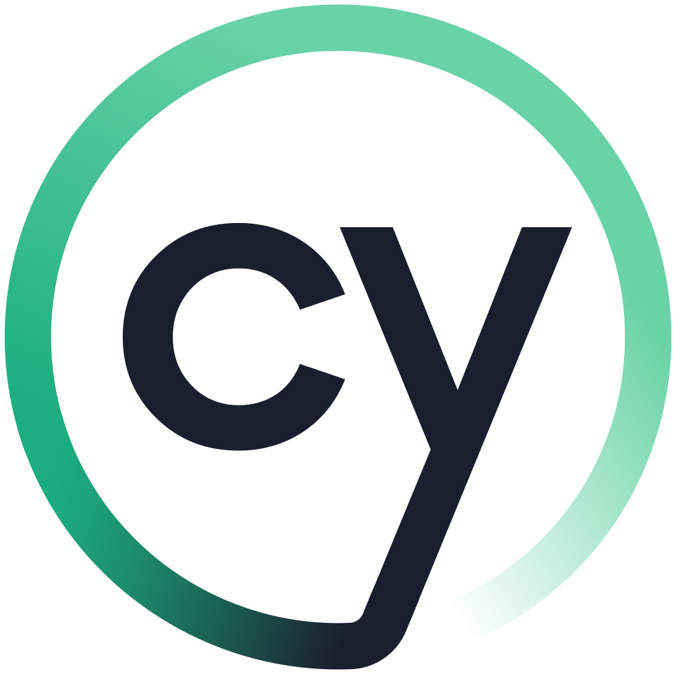

## Baz Murphy

### Full Stack Web Developer

<table>
  <tr>
    <!-- <td>Foundation</td> -->
    <td> HTML</td>
    <td> CSS</td>
    <td> JavaScript</td>
    <td> TypeScript</td>
  </tr>
    <!-- <td>Testing</td> -->
    <td> Jest</td>
    <td> Cypress</td>
    <td> Vitest</td>
    <td> RTL</td>
  </tr>
  <tr>
    <!-- <td>Frontend</td> -->
    <td> React</td>
    <td> Vite</td>
    <td> NextJS</td>
    <td>
      <!--   -->
    </td>
  </tr>
  <tr>
    <!-- <td>Backend</td> -->
    <td> NodeJS</td>
    <td> PostgreSQL</td>
    <td> MongoDB</td>
    <td> GraphQL</td>
  </tr>
  <tr>
    <!-- <td>Cloud</td> -->
    <td> AWS</td>
    <td> Docker</td>
    <td> Terraform</td>
    <td> Kubernetes</td>
  </tr>
</table>

#### Projects

- [CYF Projects Portfolio](https://cyf-bazmurphy-projects.netlify.app/)
- [CodeWars Collections Completion Tracker](https://cyf-bazmurphy-codewars.netlify.app)
- [FullStack MERN Workout Planner](https://fullstack-workout.netlify.app/)
- [FullStack PERN Video Recommendations](https://bazmurphy-fullstack-videos.netlify.app/)
- [FullStack Social Media Clone](https://bazmurphy-t3-social-media.vercel.app/)
- [FullStack PERN Ecommerce Management](https://cyf-bazmurphy-sql.onrender.com)
- [Fullstack MERN Expenses Tracker](https://bazmurphy-expense-tracker.cyclic.app/)

### Statistics

